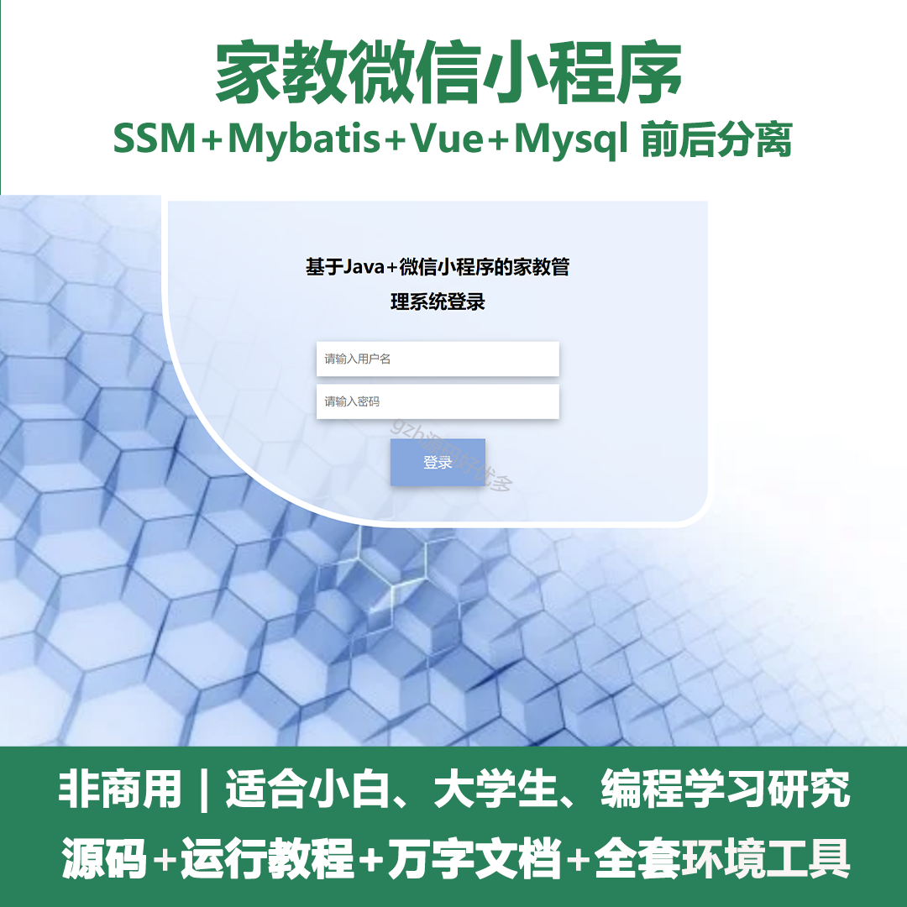
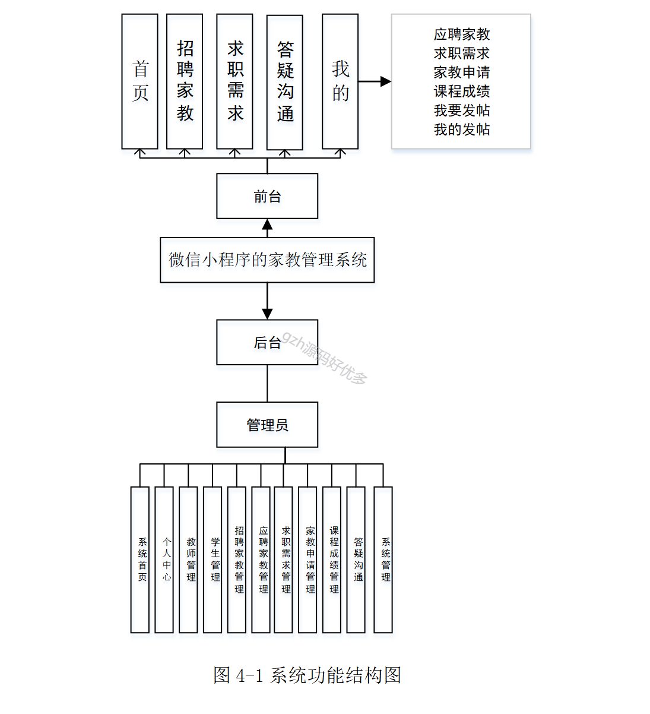
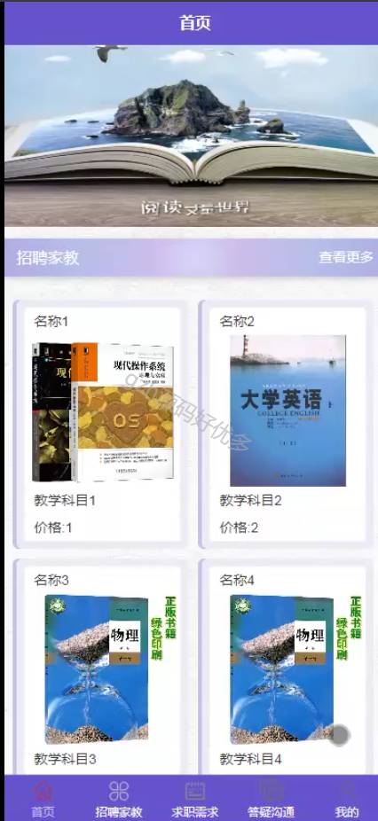
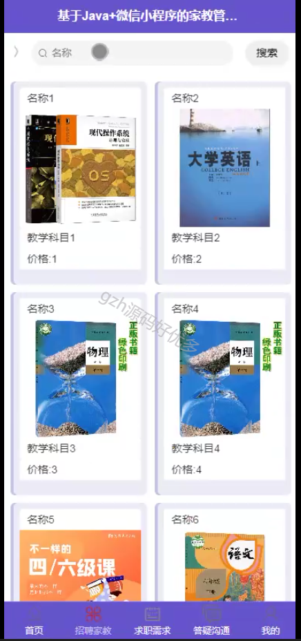
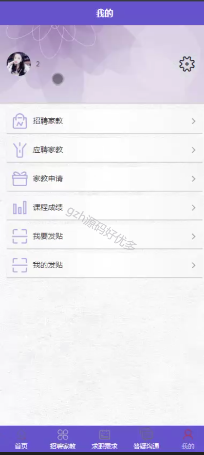
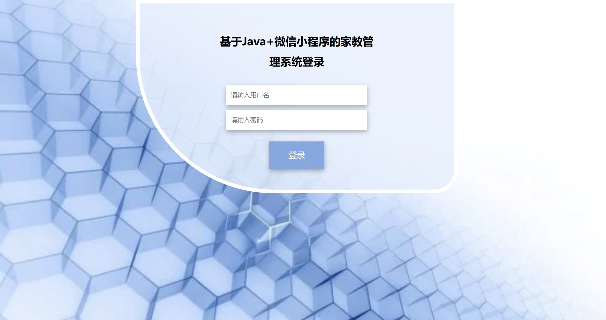
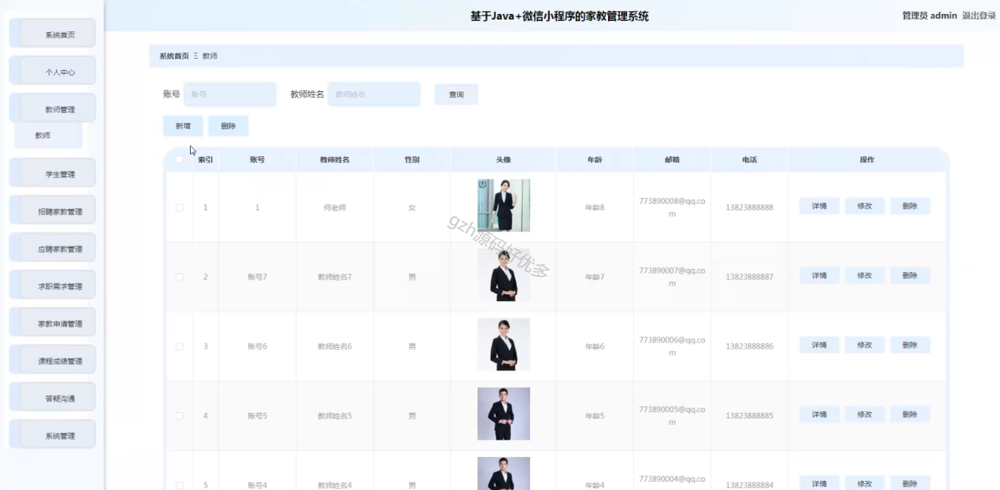
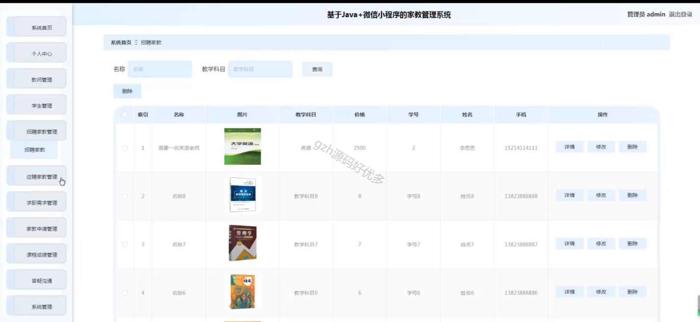
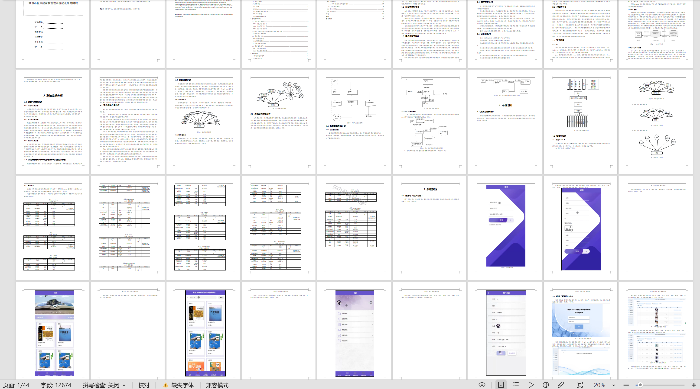

# mpweixinA062
mpweixinA062家教微信小程序LW（ssm）
 
## 查看主页获取源码

### 一、作品包含

源码+数据库+设计文档万字+全套环境和工具资源+部署教程

### 二、项目技术

前端技术：Html、Css、Js、Vue2、Element-ui、Uniapp

数据库：MySQL

后端技术：Java、SSM、MyBatis

  

### 三、运行环境

开发工具：IDEA/eclipse + HBuilderX + 微信开发者工具

数据库：MySQL5.7

数据库管理工具：Navicat10以上版本

环境配置软件： JDK1.8+Maven3.6.3+Tomcat:8.5

前端Nodejs：14

### 四、项目介绍
项目编号：mpweixinA062

此微信小程序的家教管理系统的模块分别有
前台（用户）角色：
普通用户 - 功能包括浏览首页、招聘家教、求职需求、答疑沟通和个人中心的管理。
家教老师 - 主要功能是应聘家教和管理个人资料。
后台（管理员）角色：
管理员 - 负责整个系统的管理和监督，具体功能涵盖系统首页、个人中心、教师管理、学生管理、招聘家教管理、应聘家教管理、求职需求管理、答疑沟通管理、课程成绩管理和系统管理等。

### 五、运行截图

  
